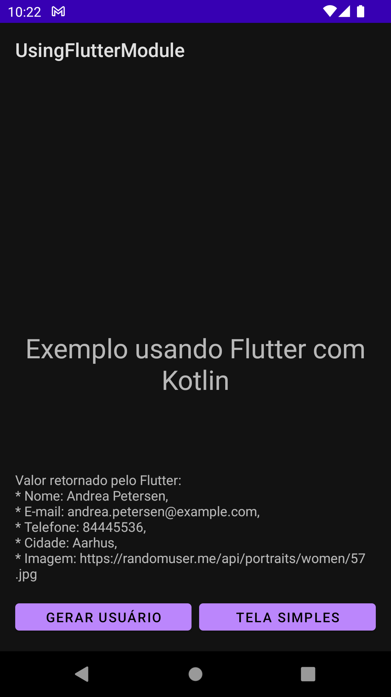
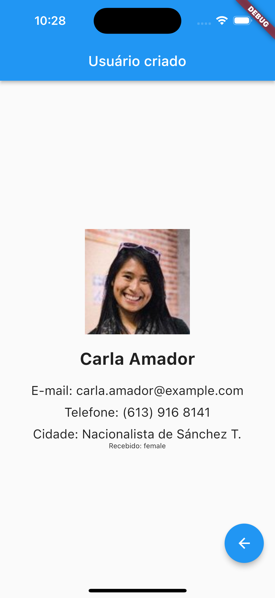
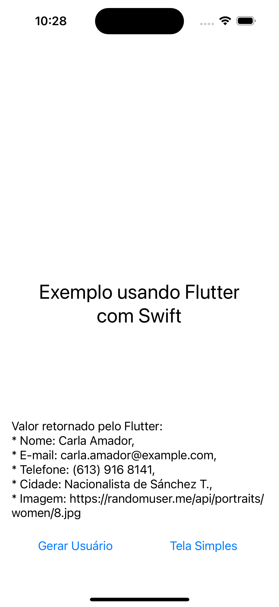
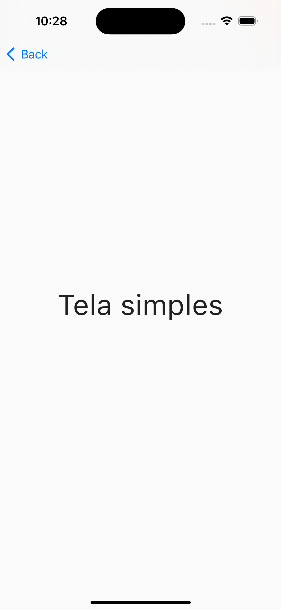

# flutter_module
* Exemplo de um módulo flutter recebendo e devolvendo parametros entre sistemas Android (Kotlin) e iOS (Swift) Nativos.

# Resultado

<div style="overflow: hidden; white-space: nowrap;">
    
    
    
    
    
    
</div>

## Configurando projeto android (Kotlin)

* Criar um módulo em flutter:
```
flutter create -t module --org br.com.megamil flutter_module
```

* Modifique o build.gradle (app) adicione o trecho abaixo em "buildTypes":

```
buildTypes {
    ...
    profile {
        initWith debug
    }
}
```

* No mesmo build.gradle (app) adicione o trecho abaixo  em "dependencies"
```
dependencies {
    ...
    debugImplementation 'br.com.megamil.flutter_module:flutter_debug:1.0'
    profileImplementation 'br.com.megamil.flutter_module:flutter_profile:1.0'
    releaseImplementation 'br.com.megamil.flutter_module:flutter_release:1.0'
}
```

* Modifique o settings.gradle, adicione os maven como no exemplo abaixo, o endereço para pasta "repo" deve apostar para onde está a biblioteca exportada
```
dependencyResolutionManagement {
    String storageUrl = System.env.FLUTTER_STORAGE_BASE_URL ?: "https://storage.googleapis.com"
    repositoriesMode.set(RepositoriesMode.FAIL_ON_PROJECT_REPOS)
    repositories {
        google()
        mavenCentral()
        maven {
            url '../../build/host/outputs/repo'
        }
        maven {
            url "$storageUrl/download.flutter.io"
        }
    }
}
```

* Para exportar para android:
```
flutter build aar
```

#### Preparando para chamar o fluxo
* Adicione no AndroidManifest.xml essa activity
```
<activity
    android:name="io.flutter.embedding.android.FlutterActivity"
    android:configChanges="orientation|keyboardHidden|keyboard|screenSize|locale|layoutDirection|fontScale|screenLayout|density|uiMode"
    android:hardwareAccelerated="true"
    android:windowSoftInputMode="adjustResize" />
```

## Configurando projeto ios (Swift)

* Configurar Podfile
Atualize o "flutter_application_path" para o caminho até a pasta ".ios" que está no flutter.
No caso aqui está assim: flutter_module/.ios
e o ios que vai usar o módulo está aqui dentro também, mas em outra subpasta:
flutter_module/examples/ios/UsingFlutterModule por isso volto 3 níveis "../../../"
```
flutter_application_path = '../../../'
load File.join(flutter_application_path, '.ios', 'Flutter', 'podhelper.rb')
```

Também adicione:
```
install_all_flutter_pods(flutter_application_path)
```

e o trecho

```
post_install do |installer|
flutter_post_install(installer) if defined?(flutter_post_install)
end
```

Exemplo completo:
```
flutter_application_path = '../../../'
load File.join(flutter_application_path, '.ios', 'Flutter', 'podhelper.rb')

target 'UsingFlutterModule' do
  # Comment the next line if you don't want to use dynamic frameworks
  use_frameworks!
  install_all_flutter_pods(flutter_application_path)
  # Pods for UsingFlutterModule

end

post_install do |installer|
  flutter_post_install(installer) if defined?(flutter_post_install)
end
```

* Para exportar para ios:
```
flutter build ios-framework
```
